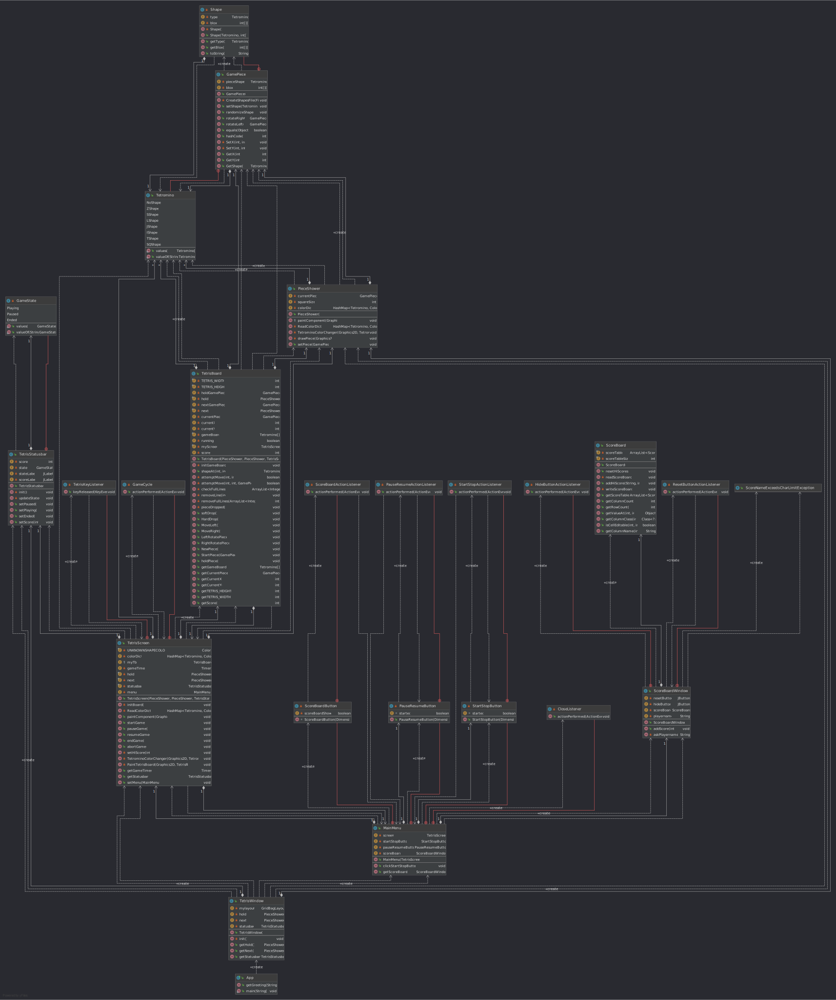
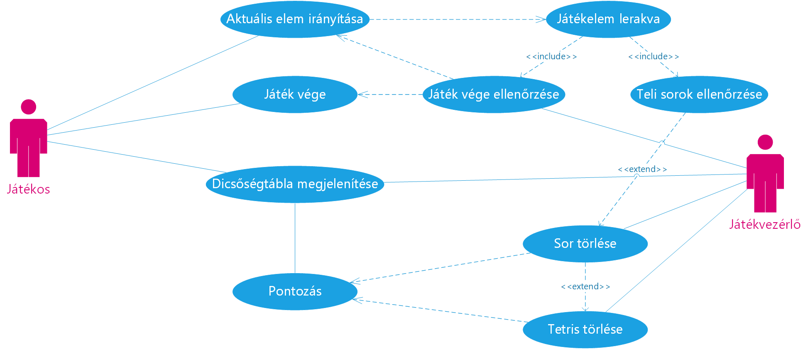

# Programozói dokumentáció

## Osztályok

> [A kép letölthető vagy böngészőből nagyobb méretben megtekinthető](https://simonyi-my.sharepoint.com/:u:/g/personal/flyinpancake_sch_bme_hu/EfdAu9OGzxpCo86nSf3iU0IBs6NOSxZNKsGbREwWnjd3kwr)

## Adatszerkezetek

A játék fő adatszerkezete a `TetrisBoard` osztály ami egy `GamePiece.Tetromino`-ból álló 2D tömböt tartalmaz. Ez tárolja a már leesett elemeket, és ez kell hogy színezni lehessen őket leesés után is. Ez az osztály végzi a játékelemek lerakását és irányítását is. A `TetrisScreen` osztály a `TetrisBoard`-al elválaszthatatlanok, mivel többek között a screen olvassa be az inputokat, időzíti a játékot és ő kezeli a `StatusBar`-t is. Továbbá a Screen felelős a fő játéktér kirajzolásáért. Ez úgy történik, hogy a először a `gameBoard`-ot rajzoljuk ki, majd rá az aktuális játékelemet.

A másik fontosabb adatszerkezet, az az alakzatdefiníciók. Ezt a program JSonből olvassa be, majd ha nincs vele probléma használja is, ellenkező esetben visszaáll az eredeti definíciókra. Minden `GamePiece` 4 blokkól áll. Ez a 4 blokk a $x,y \in ]-2;2[$ x, y koordinátákon lehet és ez ek középpontját kezeli a `TetrisScreen` `currentX`-nek és `currentY`-nak. Forgatáskor iránynak megfelelően változtatjuk a blox-ot.

## Menü

A játék menürendszere nem nyolult

* Start <-> Stop - indítja vagy megállítja a játékot

* Pause <-> Resume - szünetelteti a játékot

* Highscores - dicsőségtábla

* Exit - kilépés

Az első kettő gomb azért értdekesebb, mert ezek állapotvezéreltek. Amikor megnyomjuk a start/stop gombot átvált a másikra és aktiválja/deaktiválja a pause/resume gombot.

A Highscores gomb egy új ablakot nyit meg, ebben mutatja meg az eredményeket egy JTable-ben. Ebben az ablakban továbbá találunk egy reset gombot ami törli az eddigi eredményeket és egy hide gombot ami "bezárja" az ablakot.

## Use-case-ek

### Aktuális blokk irányítása

Egy `GamePiece` esik le és a játékos irányítja

## Blokk lerakása

Amikor egy elem leérkezik, azt a játék kezeli: 

### Játék vége ellenőrzése

Megnézi a játék hogy tud-e még új elemet indítani.

#### Játék vége

Az új elemek generálása megáll, a játékos pontot kap és ha elég, felkerül a dicsőségtáblára.

### Teli sorok ellenőrzése

Megnézi a játék hogy van-e teli sor, ha igen ezt törli.

#### Tetris törlése

Ha 4 sor telt meg egyszerre, az egy Tetris. Ekkor más pontozás lép életbe. Ezek a sorok is törlésre kerülnek

### Pontozás

A kitörölt sorok száma után a játékos pontokat kap

| Sor | Pont |
| --- | ---- |
| 1   | 100  |
| 2   | 200  |
| 3   | 300  |
| 4   | 800  |

